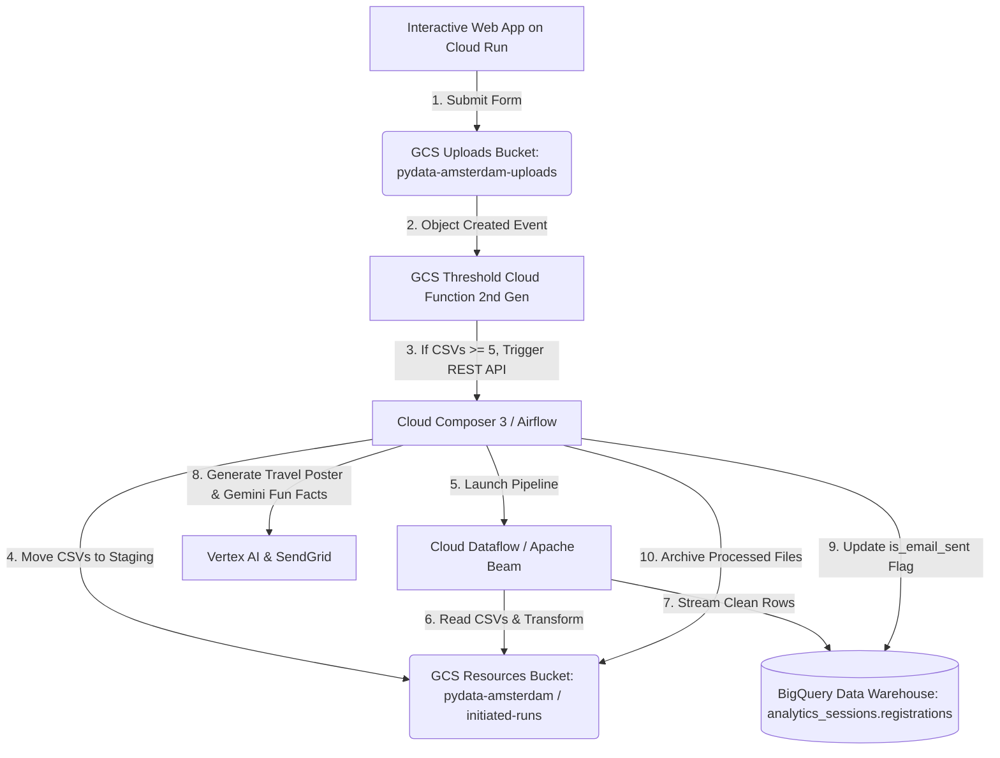

# PyData Amsterdam 2026 Workshop
## Reuniting the two distant cousins: Orchestrating your end-to-end Data Engineering Workflow Leveraging Python in Apache Beam and Apache Airflow

Welcome! This is the comprehensive, step-by-step implementation guide for the interactive workshop at **PyData Amsterdam 2026**.

In this workshop, you build an automated, event-driven data pipeline on Google Cloud Platform:
1. Develop and test an **Apache Beam** data processing pipeline locally with `DirectRunner`.
2. Scale and execute the Beam pipeline in the cloud with **Google Cloud Dataflow** (`DataflowRunner`).
3. Orchestrate the workflow end-to-end with **Cloud Composer 3 (Managed Service for Apache Airflow)**.
4. Trigger the DAG dynamically using an event-driven **Cloud Function (2nd Gen)** based on a file threshold.
5. Generate AI-enriched emails featuring **Gemini 2.5 Flash** fun facts and personalized travel posters generated by **Gemini 2.5 Flash Image (Vertex AI)**.
6. Deploy an interactive **Cloud Run** testing portal for live audience participation.

---

## 🏗️ Architecture Overview



---

## ⏱️ Step-by-Step Implementation Guide

---

### Step 0: Cloud Shell Activation & Environment Setup

Open [Google Cloud Console](https://console.cloud.google.com) and click **Activate Cloud Shell** (`>_`).

```bash
# 1. Authenticate with your administrator account
gcloud auth login admin@sadeeq.altostrat.com

# 2. Configure active project
export PROJECT_ID="pydata-amsterdam-data-demo"
gcloud config set project $PROJECT_ID

# 3. Create project workspace directory in Cloud Shell
mkdir -p $HOME/pydata-amsterdam
cd $HOME/pydata-amsterdam

# 4. Export environment variables
export GCP_PROJECT_NUMBER=$(gcloud projects describe $PROJECT_ID --format="value(projectNumber)")
export REGION="europe-west4"  # Amsterdam region
export BIGQUERY_LOCATION="EU"

export BQ_DATASET="analytics_sessions"
export BQ_TABLE="registrations"
export BQ_FQN="\`${PROJECT_ID}.${BQ_DATASET}.${BQ_TABLE}\`"

export RESOURCES_BUCKET="pydata-amsterdam"
export UPLOADS_BUCKET="pydata-amsterdam-uploads"

export COMPUTE_SA="${GCP_PROJECT_NUMBER}-compute@developer.gserviceaccount.com"

echo "--------------------------------------------------"
echo "Workspace Directory: $PWD"
echo "Project ID:          $PROJECT_ID"
echo "Project Number:      $GCP_PROJECT_NUMBER"
echo "Region:              $REGION"
echo "Resources Bucket:    gs://$RESOURCES_BUCKET"
echo "Uploads Bucket:      gs://$UPLOADS_BUCKET"
echo "BigQuery Dataset:    $BQ_DATASET"
echo "--------------------------------------------------"

# 5. Enable Google Cloud APIs
gcloud services enable \
  compute.googleapis.com \
  storage.googleapis.com \
  bigquery.googleapis.com \
  dataflow.googleapis.com \
  composer.googleapis.com \
  cloudfunctions.googleapis.com \
  eventarc.googleapis.com \
  run.googleapis.com \
  cloudbuild.googleapis.com \
  aiplatform.googleapis.com
```

### Step 0.1: Ensure the Default Dataflow Network Exists

Dataflow uses the project `default` VPC and its auto-created regional subnet.
The commands below are idempotent: an existing network or subnet is reused.

```bash
export DATAFLOW_NETWORK="default"
export DATAFLOW_SUBNETWORK="regions/$REGION/subnetworks/default"

if ! gcloud compute networks describe default --project="$PROJECT_ID" \
    >/dev/null 2>&1; then
  echo "Creating default auto-mode VPC network..."
  gcloud compute networks create default \
    --project="$PROJECT_ID" \
    --subnet-mode=auto \
    --bgp-routing-mode=regional
else
  echo "The default VPC network already exists."
fi

if ! gcloud compute networks subnets describe default --project="$PROJECT_ID" \
    --region="$REGION" >/dev/null 2>&1; then
  echo "The default network has no $REGION subnet."
  echo "Create it in the Cloud Console or use a custom subnet instead."
  exit 1
fi

# The Dataflow worker service account must be allowed to use this subnet.
gcloud projects add-iam-policy-binding "$PROJECT_ID" \
  --member="serviceAccount:$COMPUTE_SA" \
  --role="roles/compute.networkUser" \
  --condition=None --quiet
```

The DAG submits jobs to `regions/europe-west4/subnetworks/default` with public
worker IPs enabled by default, so dependency installation does not require
Cloud NAT. If organization policy blocks external IPs, configure Cloud NAT
for the default subnet or grant an exception before running Dataflow.

---

### Step 1: Storage Setup (GCS Buckets)

Create your Cloud Storage buckets using modern `gcloud storage` commands:

```bash
# 1. Create the Resources bucket (holds pipeline scripts, staging, temp files, and travel posters)
gcloud storage buckets create gs://$RESOURCES_BUCKET \
  --project=$PROJECT_ID \
  --location=$REGION \
  --uniform-bucket-level-access

# 2. Create the Uploads bucket (receives incoming registration CSV files)
gcloud storage buckets create gs://$UPLOADS_BUCKET \
  --project=$PROJECT_ID \
  --location=$REGION \
  --uniform-bucket-level-access

# 3. Create folder placeholders in the Resources bucket
touch .keep
gcloud storage cp .keep gs://$RESOURCES_BUCKET/staging/.keep
gcloud storage cp .keep gs://$RESOURCES_BUCKET/temp/.keep
gcloud storage cp .keep gs://$RESOURCES_BUCKET/initiated-runs/.keep
gcloud storage cp .keep gs://$RESOURCES_BUCKET/completed-runs/.keep
gcloud storage cp .keep gs://$RESOURCES_BUCKET/posters/.keep
rm .keep

# 4. Verify bucket creation
gcloud storage ls --project=$PROJECT_ID
```

---

### Step 2: BigQuery Dataset & Destination Table Setup

Create the BigQuery dataset `analytics_sessions` and table `registrations` to store validated registrations:

```bash
# 1. Create BigQuery Dataset
bq --location=$BIGQUERY_LOCATION mk \
  --dataset \
  --description "Dataset for PyData Amsterdam Workshop" \
  ${PROJECT_ID}:${BQ_DATASET}

# 2. Create the Registrations Table
bq query --project_id=$PROJECT_ID --use_legacy_sql=false --location=$BIGQUERY_LOCATION "
  CREATE TABLE IF NOT EXISTS ${BQ_FQN} (
    name STRING OPTIONS(description='Registrant Name'),
    email STRING OPTIONS(description='Registrant Email'),
    location STRING OPTIONS(description='Registrant Location'),
    timestamp TIMESTAMP OPTIONS(description='Pipeline Processing Timestamp UTC'),
    file_location STRING OPTIONS(description='GCS URI of the source file'),
    is_email_sent BOOLEAN OPTIONS(description='Flag set by Airflow after email notification')
  );
"

# 3. Verify Table Schema
bq show ${PROJECT_ID}:${BQ_DATASET}.${BQ_TABLE}
```

---

### Step 3: Grant IAM Permissions to Service Account

Assign the required roles to the service account used by Dataflow workers. The BigQuery job-user role is required because the sink creates load jobs, while the data-editor role permits writes to the destination table:

```bash
SA_ROLES=(
  "roles/dataflow.worker"
  "roles/bigquery.dataEditor"
  "roles/bigquery.jobUser"
  "roles/storage.objectAdmin"
  "roles/aiplatform.user"
  "roles/composer.user"
  "roles/eventarc.eventReceiver"
  "roles/run.invoker"
)

for ROLE in "${SA_ROLES[@]}"; do
  gcloud projects add-iam-policy-binding $PROJECT_ID \
    --member="serviceAccount:$COMPUTE_SA" \
    --role="$ROLE" \
    --condition=None --quiet >/dev/null
done

echo "✅ Service account permissions granted!"

# Ensure gcloud uses the workshop project for API quota and Dataflow commands.
gcloud config set billing/quota_project "$PROJECT_ID"
```

---

### Step 4: Apache Beam Progression (Local -> Cloud Dataflow -> Staging)

Demonstrate progressive isolation by first running the pipeline locally with `DirectRunner`, then scaling to standalone `DataflowRunner` via CLI, and finally staging for Airflow.

#### 4.1. Setup Python Virtual Environment in Cloud Shell

```bash
cd $HOME/pydata-amsterdam

# Pull repository files into the Cloud Shell workspace folder
git clone https://github.com/SadeeqAkintola/pydata-amsterdam.git . || echo "Repository already present"

# Create and activate a Python 3.11 virtual environment
python3 -m venv beam-venv
source beam-venv/bin/activate

# Install Apache Beam with GCP support
pip install --upgrade pip
pip install "apache-beam[gcp]>=2.57.0"
```

#### 4.2. Run Apache Beam Locally (`DirectRunner`)

Create a local sample CSV file and execute the pipeline using `DirectRunner` to verify logic and write directly to BigQuery:

```bash
# 1. Create a local test CSV file
cat << 'EOF' > local_test_sample.csv
name,email,location
Guido van Rossum,guido@python.org,Amsterdam
EOF

# 2. Run the Beam Pipeline locally
python3 beam_pipeline.py \
  --runner=DirectRunner \
  --input_pattern=local_test_sample.csv \
  --output_table=${PROJECT_ID}:${BQ_DATASET}.${BQ_TABLE} \
  --temp_location=gs://$RESOURCES_BUCKET/temp

# 3. Verify the row in BigQuery
bq query --project_id=$PROJECT_ID --use_legacy_sql=false --location=$BIGQUERY_LOCATION "
  SELECT name, email, location, timestamp FROM ${BQ_FQN} WHERE email = 'guido@python.org';
"
```

#### 4.3. Run Apache Beam on Cloud Dataflow (`DataflowRunner`)

Upload a sample file to GCS and run the Beam pipeline as a standalone Cloud Dataflow job:

```bash
# 1. Upload sample CSV to GCS initiated-runs folder
gcloud storage cp local_test_sample.csv gs://$RESOURCES_BUCKET/initiated-runs/sample_dataflow_test.csv

# 2. Launch the job on Cloud Dataflow
python3 beam_pipeline.py \
  --runner=DataflowRunner \
  --project=$PROJECT_ID \
  --region=$REGION \
  --network=$DATAFLOW_NETWORK \
  --subnetwork=$DATAFLOW_SUBNETWORK \
  --input_pattern=gs://$RESOURCES_BUCKET/initiated-runs/*.csv \
  --output_table=${PROJECT_ID}:${BQ_DATASET}.${BQ_TABLE} \
  --temp_location=gs://$RESOURCES_BUCKET/temp \
  --staging_location=gs://$RESOURCES_BUCKET/staging

# 3. Monitor the Dataflow job
gcloud dataflow jobs list --region=$REGION --status=active
```

#### 4.4. Stage `beam_pipeline.py` to GCS for Airflow Orchestration

```bash
gcloud storage cp beam_pipeline.py gs://$RESOURCES_BUCKET/beam_pipeline.py
gcloud storage ls gs://$RESOURCES_BUCKET/beam_pipeline.py
```

---

### Step 5: Cloud Composer 3 Setup & Airflow Orchestration

Deploy the workflow to Cloud Composer 3.

```bash
export COMPOSER_ENV_NAME="pydata-composer-3"

# 1. Create Cloud Composer 3 Environment (Takes ~10-15 mins)
gcloud composer environments create $COMPOSER_ENV_NAME \
  --location=$REGION \
  --image-version=composer-3-airflow-2.9.3 \
  --service-account=$COMPUTE_SA

# 2. Retrieve DAGs folder GCS path & Web Server URL
export DAGS_BUCKET=$(gcloud composer environments describe $COMPOSER_ENV_NAME \
  --location=$REGION \
  --format="value(config.dagGcsPrefix)")

export AIRFLOW_UI_URL=$(gcloud composer environments describe $COMPOSER_ENV_NAME \
  --location=$REGION \
  --format="value(config.airflowUri)")

echo "Composer DAGs Path: $DAGS_BUCKET"
echo "Airflow Web UI:     $AIRFLOW_UI_URL"

# 3. Set the SendGrid API Key Airflow Variable
gcloud composer environments run $COMPOSER_ENV_NAME \
  --location=$REGION \
  variables set -- SENDGRID_API_KEY "YOUR_SENDGRID_API_KEY_HERE"

# 4. Upload the Airflow DAG
gcloud storage cp airflow_beam_dag.py $DAGS_BUCKET/airflow_beam_dag.py
```

---

### Step 6: Deploy Event-Driven Threshold Cloud Function (2nd Gen)

Deploy the Cloud Function that counts CSV files in `gs://pydata-amsterdam-uploads` and triggers the Airflow DAG when $\ge 5$ files are present:

```bash
cd $HOME/pydata-amsterdam/cloud_function

gcloud functions deploy trigger-airflow-beam-dag \
  --gen2 \
  --region=$REGION \
  --runtime=python311 \
  --source=. \
  --entry-point=trigger_dag_gcf \
  --trigger-bucket=$UPLOADS_BUCKET \
  --trigger-location=$REGION \
  --set-env-vars AIRFLOW_UI_URL=$AIRFLOW_UI_URL,TARGET_DAG_ID=airflow_beam_dag,TRIGGER_THRESHOLD=5 \
  --service-account=$COMPUTE_SA
```

---

### Step 7: Deploy Interactive Testing Web Application on Cloud Run

Deploy the audience participation portal to Cloud Run:

```bash
cd $HOME/pydata-amsterdam/interactive_app

# Deploy to Cloud Run
gcloud run deploy pydata-interactive-app \
  --source=. \
  --region=$REGION \
  --allow-unauthenticated \
  --set-env-vars RUNTIME_UPLOADS_BUCKET=$UPLOADS_BUCKET,TRIGGER_THRESHOLD=5

# Retrieve public web application URL
export APP_URL=$(gcloud run services describe pydata-interactive-app --region=$REGION --format="value(status.url)")
echo "=================================================="
echo " Audience Portal Live at: $APP_URL"
echo "=================================================="
```

---

### Step 8: Live End-to-End Testing & Verification

1. **Audience Submission**:
   - Attendees access the Cloud Run web application URL (or short link `bit.ly/pydata-amsterdam-demo`).
   - Each submission generates a CSV file and uploads it into `gs://pydata-amsterdam-uploads`.
2. **Threshold Trigger**:
   - When the 5th file is uploaded, the Cloud Function fires and triggers `airflow_beam_dag` via the Airflow REST API.
3. **Pipeline Execution**:
   - Airflow stages files to `gs://pydata-amsterdam/initiated-runs`.
  - Dataflow processes the batch and appends records to BigQuery dataset `analytics_sessions`.
   - Airflow generates **Gemini 2.5 Flash Image** travel posters and **Gemini 2.5 Flash** fun facts, dispatching personalized follow-up emails.
   - Files are moved to `gs://pydata-amsterdam/completed-runs`.
4. **Verification Queries in Cloud Shell**:

```bash
# 1. Check Cloud Function trigger logs
gcloud functions logs read trigger-airflow-beam-dag --region=$REGION --gen2 --limit=15

# 2. Query BigQuery table for final processed rows
bq query --project_id=$PROJECT_ID --use_legacy_sql=false --location=$BIGQUERY_LOCATION "
  SELECT name, email, location, timestamp, is_email_sent
  FROM ${BQ_FQN}
  ORDER BY timestamp DESC;
"
```

---

### Step 9: Post-Workshop Teardown & Cleanup

```bash
# 1. Delete Cloud Run Service
gcloud run services delete pydata-interactive-app --region=$REGION --quiet

# 2. Delete Cloud Function
gcloud functions delete trigger-airflow-beam-dag --region=$REGION --gen2 --quiet

# 3. Delete Composer Environment
gcloud composer environments delete $COMPOSER_ENV_NAME --location=$REGION --quiet

# 4. Delete Storage Buckets
gcloud storage rm --recursive gs://$RESOURCES_BUCKET
gcloud storage rm --recursive gs://$UPLOADS_BUCKET

# 5. Delete BigQuery Dataset
bq rm -r -f --dataset ${PROJECT_ID}:${BQ_DATASET}
```
